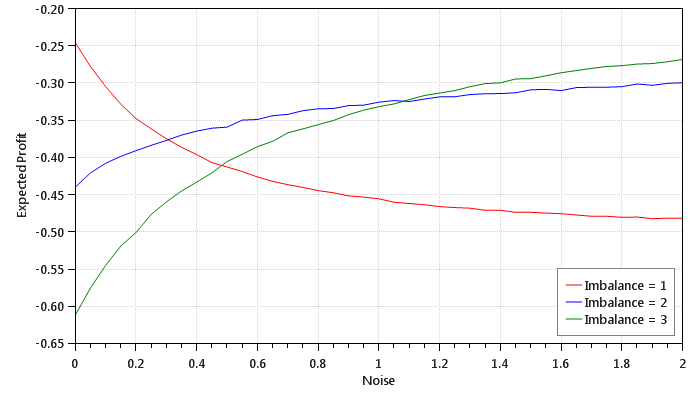
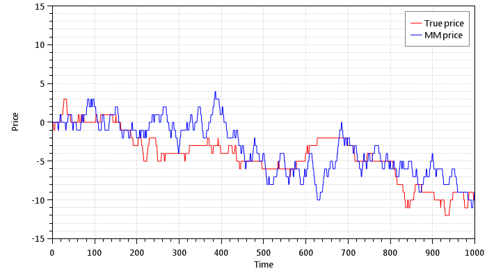
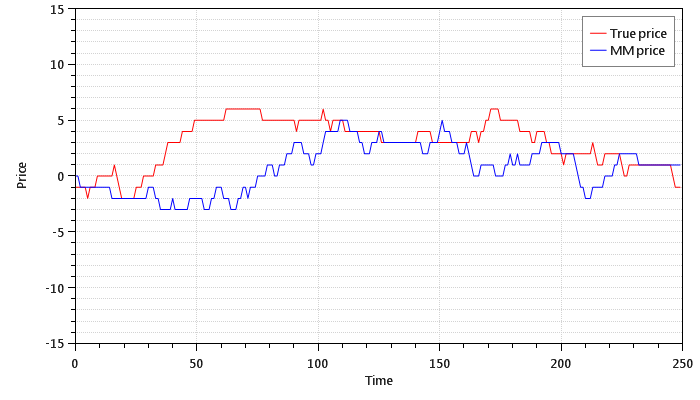
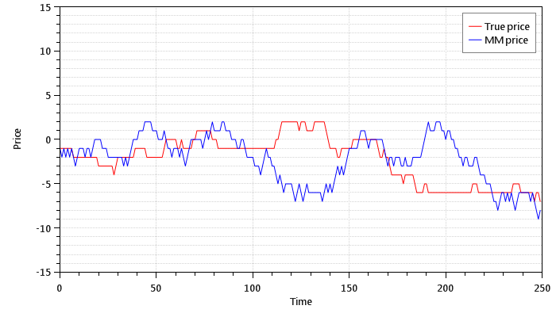
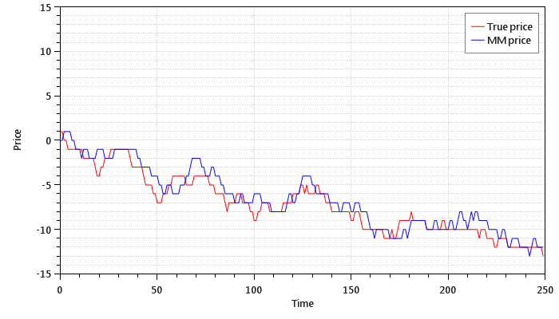
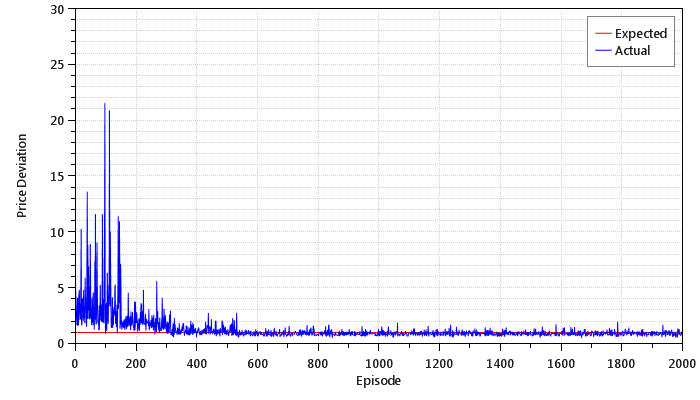
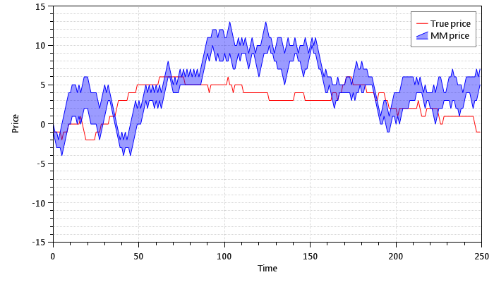
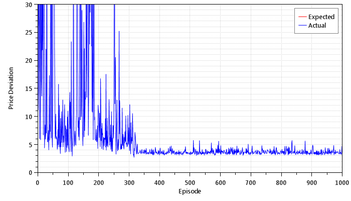

## Overview

This is a study of [*An Electronic Market-Maker*](http://dspace.mit.edu/handle/1721.1/7220) by Nicholas Tung Chan and Christian Shelton.

#### 01 - Expected Profit

This is a Monte Carlo simulation of the basic model that computes the expected profit. The following is a reproduction of Figure 3 from the paper:

These are plots of the true price and market price for strategies 1, 2, and 3, respectively, when the noise factor alphaU = 0.4:

These are plots of the true price and market price for strategies 1, 2, and 3, respectively, when the noise factor alphaU = 1.0:

These are plots of the true price and market price for strategies 1, 2, and 3, respectively, when the noise factor alphaU = 1.6:

#### 02 - Basic Model (SARSA)

This is an implementation of the basic model that uses the SARSA learning method to choose the optimum strategy. The following is a reproduction of Figure 5 from the paper:

* Episode 25

* Episode 100

* Episode 200

* Episode 500

The following is a reproduction of Figure 6a from the paper:

The following is a reproduction of Figure 6b from the paper:

The following is a reproduction of Figure 6c from the paper:

#### 03 - Extended Model (SARSA)

This is an implementation of the extended model that uses the SARSA learning method to choose the optimum spread. The following is a reproduction of Figure 9 from the paper:

* Episode 25

* Episode 100

* Episode 200

* Episode 500

The following is a reproduction of Figure 10a from the paper:

The following is a reproduction of Figure 10b from the paper:

The following is a reproduction of Figure 10c from the paper:

The following is a reproduction of Figure 10d from the paper:

